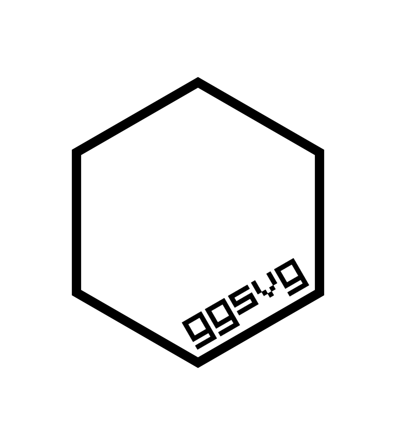

<!-- README.md is generated from README.Rmd. Please edit that file -->

```{r, include = FALSE}
knitr::opts_chunk$set(
  collapse = TRUE,
  comment = "#>",
  fig.path = "man/figures/README-",
  # out.width = "100%",
  fig.width  = 6,
  fig.height = 4
)

library(ggplot2)
library(ggsvg)

set.seed(1)

#~~~~~~~~~~~~~~~~~~~~~~~~~~~~~~~~~~~~~~~~~~~~~~~~~~~~~~~~~~~~~~~~~~~~~~~~~~~~~
# Generate the pkgdown documentation
#~~~~~~~~~~~~~~~~~~~~~~~~~~~~~~~~~~~~~~~~~~~~~~~~~~~~~~~~~~~~~~~~~~~~~~~~~~~~~
if (FALSE) {
  pkgdown::build_site(override = list(destination = "../coolbutuseless.github.io/package/ggsvg"))
}
```

# ggsvg - Use SVG as points in ggplot  

<!-- badges: start -->

[](https://github.com/coolbutuseless/ggsvg/actions)
<!-- badges: end -->

`ggsvg` is an extension to ggplot to use SVG images for points.

Variables may be aesthetically mapped to features within the SVG using CSS selectors via
the `css()` helper function.


## What's in the box

* `geom_point_svg()` for plotting points with SVG as the glyph (This is a direct
   analogue to `geom_point()`)
* `scale_svg_*()` functions for controlling the aesthetic mapping.
    * `scale_svg_default()` is a sensible default for most plots.
    * `scale_svg_*` are a shadow set of `ggplot2::scale_*()` functions with
      adaptations needed for `css()` selectors as aesthetics.
    * E.g. `scale_svg_fill_brewer()` is a direct analogue for
      `ggplot2::scale_fill_brewer()`

## Installation

Install from [GitHub](https://github.com/coolbutuseless/ggsvg).

The [`{rsvg}`](https://github.com/ropensci/rsvg) package is used 
to convert SVG into an R raster object.  This requires at least rsvg(>= 2.3.0).

``` r
# install.package('remotes')
install.packages('rsvg')
remotes::install_github('coolbutuseless/ggsvg')
```


# Simple plot

```{r fig.height=1, eval=FALSE}
svg_url <- 'https://www.svgrepo.com/download/289000/jellyfish.svg'
svg_txt <- paste(readLines(svg_url), collapse = "\n")
```


```{r eval=TRUE, echo=FALSE}
# Local cache
svg_txt <- paste(readLines("man/figures/test.svg"), collapse = "\n")
```


```{r fig.height=1}
grid::grid.draw( svg_to_rasterGrob(svg_txt) )
```


```{r}
test_df <- data.frame(
  x = runif(10), 
  y = runif(10), 
  count = sample(3:5, 10, T),
  type  = sample(c('a', 'b', 'c'), 10, T))

test_df

ggplot(test_df) + 
  geom_point_svg(aes(x, y), svg = svg_txt) + 
  theme_bw()
```


# Simple plot with mapped `size` aesthetic


```{r  warning=FALSE}
ggplot(test_df) + 
  geom_point_svg(aes(x, y, size = type), svg = svg_txt) + 
  theme_bw()
```


## Mapping Aesthetics to SVG features with CSS Selectors

Aesthetic values are mapped to SVG features with
[CSS Selectors](https://developer.mozilla.org/en-US/docs/Web/CSS/CSS_Selectors).

#### Snowman SVG

Here is a simple SVG consisting of 2 stacked circles - a big circle on the 
bottom and a small circle resting on top.

```{r fig.height=1}
snowman_txt <- '
  <svg viewBox="0 0 100 100 ">
    <circle id="top" cx="50" cy="20" r="20" fill="brown" stroke="black" />
    <circle id="bot" cx="50" cy="70" r="30" fill="brown" stroke="black" />
  </svg>
  '

grid::grid.draw( svg_to_rasterGrob(snowman_txt, width=800, height=800) )
```


#### `css()` helper function

Use the `css()` helper function to target aesthetics at selected elements within 
an SVG using `css(selector, property = value)`

E.g. 

* **`css("rect.big", stroke = x)`**
    * Targets `<rect>` elements with `class = "big"`
    * Map values in `x` in data.frame to the SVG `stroke` property for these targetted elements.

#### Example
In the following example, two `css()` selectors are used within the `geom_point_svg()` call:

* **`css("circle#top", fill=type)`**
    * Targets `<circle>` elements with `id = "top"`
    * Map values in `type` in data.frame to the SVG `fill` property for these targetted
      elements.
      
* **`css("circle#bot", stroke='brown')`**
    * Targets `<circle>` elements with `id = "bot"`
    * Set a constant value of `brown` for the SVG `stroke` property for these targetted
      elements.
      
* **`css("circle", 'stroke-width'=10)`**
    * Targets `<circle>` elements
    * Set a constant value of `5` for the SVG `stroke-wdith` property for these targetted
      elements.


To configure how the variable is mapped to the property on the selected target,
you can either use:

* `scale_svg_default()` for reasonable defaults
* `scale_svg_*()` family of functions
    * Note: the `aesthetic` argument must match exactly the
      `css(...)` call used in the `geom_point_svg()` call.


```{r message = FALSE}
snowman_txt <- '
  <svg viewBox="0 0 100 100 ">
    <circle id="top" cx="50" cy="20" r="20" fill="brown" stroke="black" />
    <circle id="bot" cx="50" cy="70" r="30" fill="brown" stroke="black" />
  </svg>
  '


ggplot(test_df) + 
  geom_point_svg(
    aes(x, y, css("circle#top", fill = type)),
    css("circle#bot", stroke = 'brown'),
    css("circle", 'stroke-width'=10),
    svg = snowman_txt
  ) +
  theme_bw() + 
  scale_svg_fill_brewer(aesthetics = css("circle#top", fill = type), palette = 'Dark2')
```


## Acknowledgements

* R Core for developing and maintaining the language.
* CRAN maintainers, for patiently shepherding packages onto CRAN and maintaining
  the repository
