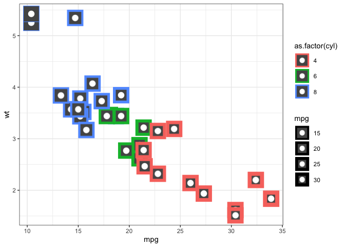
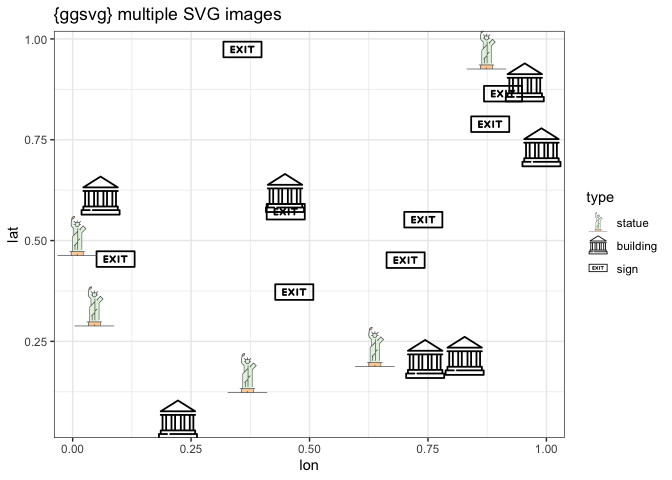
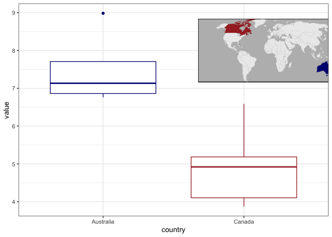

<!-- README.md is generated from README.Rmd. Please edit that file -->

# ggsvg - Use SVG as points in ggplot 

### With the novel capability of aesthetic mappings to *any* SVG feature

<!-- badges: start -->


[](https://github.com/coolbutuseless/ggsvg/actions)
<!-- badges: end -->

`ggsvg` is an extension to ggplot to use SVG for points.

The SVG may be customised to respond to aesthetics e.g. element colours
can changes in response to fill and/or colour scales.

Note that aesthetics are not limited to colour - any other SVG
parameter/value can be linked to any aesthetic which makes sense e.g. an
aesthetic may be used to control the corner radius on a rounded
rectangle.

### Note: `{ggsvg}` is currently undergoing rapid development. Keep an eye on this README and the vignettes to see examples of current usage.

## What’s in the box

-   `geom_point_svg()` is equivalent to `geom_point()` except it also
    requires SVG text to be set (via the `svg` argument or aesthetic
    mapping)
-   `scale_svg_*` a complete set of compatible scale functions for
    controlling the mapping of values to arbitrary named aesthetics.

## Installation

Install from [GitHub](https://github.com/coolbutuseless/ggsvg).

The [rsvg](https://github.com/ropensci/rsvg) package (\>= 2.3.0) is used
to convert SVG into an R raster object.

``` r
# install.package('remotes')
remotes::install_github('coolbutuseless/ggsvg')
```

## Note on SVG2 CSS support in librsvg

SVG2 add support for CSS styling of geometry properties e.g. styling
‘rx’ on `rect` elements.

`librsvg` support for SVG2 is good, but still evolving rapidly as of
v2.54.0. Install the latest version of librsvg (and perhaps build
`{rsvg}` from source) in order to get the best CSS support.

## Note on preferred names for non-standard aesthetics

The `ggplot2` packages knows about a certain set of aesthetics: alpha,
colour, fill, linetype, shape, size etc. And it knows how to find
appropriate default *scales* for each of these aesthetics in order to
convert, say, numeric values in a data.frame into colours for points.

In `ggsvg` novel aesthetics are being created during plot creation in
order to colour/style the SVG. Since `ggplot2` won’t know how to find an
appropriate default scale to go with these aesthetics, the user may name
things carefully in order to trigger some automatic detection within the
ggsvg package.

1.  Name aesthetics to be of the form `[blah]_[type]` with an underscore
    -   e.g. “circle_radius”, “rect_colour”, “cat_fill”
2.  Apply a general default scale for these specially named aesthetics
    by adding `scale_svg_default()` to the plot.
3.  To get a *good* plot, you’ll probably still need to add specific
    scales to carefully control the value mapping
    e.g. `scale_svg_fill_brewer(aesthetics = "rect_fill")`

If you ever encounter a target type colour or numeric CSS property that
isn’t handled automatically (such that you *have* to use a specific
`scale_svg_*()` function), then please file an issue on Github.

Note that any CSS properties that are specified as text
(e.g. `font-family`) do not currently have any built-in scale. Instead
you will have to specify the possible values for such a scale using
e.g. `scale_svg_discrete_manual()`.

# Using an existing SVG

In the simplest case where the user just wants to use an SVG as a
plotting glyph, only two changes are needed over a basic ggplot:

1.  Use `geom_point_svg()`
2.  specify the `svg =` argument

``` r
#~~~~~~~~~~~~~~~~~~~~~~~~~~~~~~~~~~~~~~~~~~~~~~~~~~~~~~~~~~~~~~~~~~~~~~~~~~
# Read SVG from the web
#~~~~~~~~~~~~~~~~~~~~~~~~~~~~~~~~~~~~~~~~~~~~~~~~~~~~~~~~~~~~~~~~~~~~~~~~~~
car_url <- 'https://www.svgrepo.com/download/114837/car.svg'
car_svg <- paste(readLines(car_url), collapse = "\n")
```

``` r
grid::grid.draw( svg_to_rasterGrob(car_svg) )
```


``` r
ggplot(mtcars) + 
  geom_point_svg(aes(mpg, wt), svg = car_svg, size = 8) + 
  theme_bw()
```


``` r
ggplot(mtcars) + 
  geom_point_svg(aes(mpg, wt, size = mpg), svg = car_svg) + 
  theme_bw()
```


# Using “CSS Aesthetics” to style an existing SVG

New aesthetics can be used which map from ggplot values into the SVG’s
CSS.

You’ll have to know some SVG and CSS to achieve this, as well as being
comfortable with the use of ggplot2 scales.

In his particular case in the SVG for the car, the 3rd path element in
the SVG is the body of the car. This is equivalent to a a CSS selector
or `path:nth-child(3)`.

Then we map the `fill` CSS property to `as.factor(cyl)` by writing the
mapped aesthetic as
`aes(..., "css=path:nth-child(3):fill" = as.factor(cyl))`.

Further, since this is not a standard aesthethic name, ggplot does not
know how to translate the cylinder values into what this new aesthetic
represents, so we have to explicitly nominate this as a fill by using
`scale_svg_fill_discrete()`

``` r
ggplot(mtcars) + 
  geom_point_svg(
    # aes(mpg, wt, size = mpg, fill = as.factor(cyl)), 
    aes(mpg, wt, css("path:nth-child(3)", fill = as.factor(cyl))),
    size = 8,
    svg = car_svg
  ) +
  theme_bw() + 
  scale_svg_default()
```


## CSS Aesthetics 2

``` r
svg_text <- '
  <svg viewBox="0 0 100 100 ">
    <rect width="100" height="100" fill="#555555" 
        style="stroke: black; stroke-width: 20"/>
    <circle class="pale" cx="50" cy="50" r="20" fill="white" />
  </svg>
  '

grid::grid.draw( svg_to_rasterGrob(svg_text) )
```


``` r
p <- ggplot(mtcars) + 
  geom_point_svg(
    aes(
      mpg, wt, 
      css("rect", "stroke-width" = mpg), 
      css("rect", stroke = as.factor(cyl))
    ), 
    svg = svg_text, 
    size = 8) +
  theme_bw() + 
  scale_svg_default() +
  scale_svg_size_continuous(aesthetics = css("rect", "stroke-width"), range = c(5, 50))

p
```



# Parameterising an SVG and using custom aesthetics

Another way of customising SVG to is to convert the SVG text into a
parameterised string to use with glue.

The parameters in the string are then mapped to values using ggplot2 -
again using a new aesthetic name and nominating the type of scale to use
to map values

1.  Create or edit a base SVG
2.  Parameterise the SVG using glue placeholders for values later filled
    by ggplot

## (1) Create base SVG Image

The following simple SVG constructed by hand is just a square and a
circle.

``` r
library(ggplot2)
library(ggsvg)

#~~~~~~~~~~~~~~~~~~~~~~~~~~~~~~~~~~~~~~~~~~~~~~~~~~~~~~~~~~~~~~~~~~~~~~~~~~
# Define simple SVG
#   - Square with rounded corners and a circle inside it.
#~~~~~~~~~~~~~~~~~~~~~~~~~~~~~~~~~~~~~~~~~~~~~~~~~~~~~~~~~~~~~~~~~~~~~~~~~~
simple_text <- '
  <svg viewBox="0 0 100 100 ">
    <rect width="100" height="100" fill="#88ccaa" />
    <circle cx="50" cy="50" r="40" fill="white" />
  </svg>
  '

grid::grid.draw( svg_to_rasterGrob(simple_text) )
```


## (2) Parameterise the SVG

Introduce parameters in the SVG using [glue]() syntax with double curly
braces i.e. `{{}}`

``` r
#~~~~~~~~~~~~~~~~~~~~~~~~~~~~~~~~~~~~~~~~~~~~~~~~~~~~~~~~~~~~~~~~~~~~~~~~~~
# Define simple SVG
#   - Square with rounded corners and a circle inside it.
#~~~~~~~~~~~~~~~~~~~~~~~~~~~~~~~~~~~~~~~~~~~~~~~~~~~~~~~~~~~~~~~~~~~~~~~~~~
parameterised_text <- '
  <svg viewBox="0 0 100 100 ">
    <rect width="100" height="100" fill="{{rect_colour}}" />
    <circle cx="50" cy="50" r="{{circle_radius}}" fill="white" />
  </svg>
  '

#~~~~~~~~~~~~~~~~~~~~~~~~~~~~~~~~~~~~~~~~~~~~~~~~~~~~~~~~~~~~~~~~~~~~~~~~~~
# Test the glue parameters
#~~~~~~~~~~~~~~~~~~~~~~~~~~~~~~~~~~~~~~~~~~~~~~~~~~~~~~~~~~~~~~~~~~~~~~~~~~
rect_colour   <- 'green'
circle_radius <- 10

final_text <- glue::glue(parameterised_text, .open = "{{", .close = "}}")

grid::grid.draw( svg_to_rasterGrob(final_text) )
```



## (3) Map ggplot2 aesthetics to the parameterised SVG

``` r
ggplot(mtcars) +
  geom_point_svg(
    mapping  = aes(mpg, wt, circle_radius=as.factor(cyl), rect_colour = disp),
    svg      = parameterised_text,
    size     = 10,
    defaults = list(rect_colour = 'black', circle_radius = 40)
  ) +
  theme_bw() + 
  labs(title = "{ggsvg} Using SVG as points") + 
  scale_svg_default() +
  scale_svg_size_discrete(
    aesthetics = 'radius', 
    range = c(10, 45),
    guide = guide_legend(override.aes = list(size = 7))
  ) 
#> Warning: Using size for a discrete variable is not advised.

#> Warning: Using size for a discrete variable is not advised.
```



## Acknowledgements

-   R Core for developing and maintaining the language.
-   CRAN maintainers, for patiently shepherding packages onto CRAN and
    maintaining the repository
