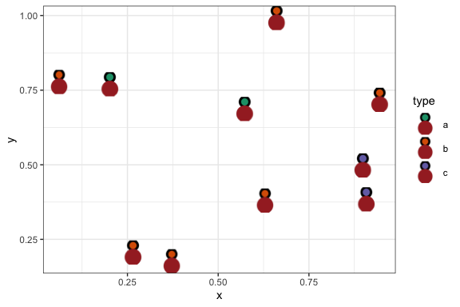

<!-- README.md is generated from README.Rmd. Please edit that file -->

# ggsvg - Use SVG as points in ggplot 

### With the novel capability of aesthetic mappings to *any* SVG feature

<!-- badges: start -->


[](https://github.com/coolbutuseless/ggsvg/actions)
<!-- badges: end -->

`ggsvg` is an extension to ggplot to use SVG for points.

The SVG may be customised to respond to aesthetics e.g. element colours
can changes in response to fill and/or colour scales.

Note that aesthetics are not limited to colour - any other SVG
parameter/value can be linked to any aesthetic which makes sense e.g. an
aesthetic may be used to control the corner radius on a rounded
rectangle.

## What’s in the box

-   `geom_point_svg()` is equivalent to `geom_point()` except it also
    requires SVG text to be set (via the `svg` argument or aesthetic
    mapping)
-   `scale_svg_*` a complete set of compatible scale functions for
    controlling the mapping of values to arbitrary named aesthetics.

## Installation

Install from [GitHub](https://github.com/coolbutuseless/ggsvg).

The [rsvg](https://github.com/ropensci/rsvg) package (\>= 2.3.0) is used
to convert SVG into an R raster object.

``` r
# install.package('remotes')
remotes::install_github('coolbutuseless/ggsvg')
```

# Using an existing SVG

In the simplest case where the user just wants to use an SVG as a
plotting glyph, only two changes are needed over a basic ggplot:

1.  Use `geom_point_svg()`
2.  specify the `svg =` argument

``` r
#~~~~~~~~~~~~~~~~~~~~~~~~~~~~~~~~~~~~~~~~~~~~~~~~~~~~~~~~~~~~~~~~~~~~~~~~~~
# Read SVG from the web
#~~~~~~~~~~~~~~~~~~~~~~~~~~~~~~~~~~~~~~~~~~~~~~~~~~~~~~~~~~~~~~~~~~~~~~~~~~
car_url <- 'https://www.svgrepo.com/download/114837/car.svg'
car_svg <- paste(readLines(car_url), collapse = "\n")
```

``` r
grid::grid.draw(svg_to_rasterGrob(car_svg))
```


``` r
ggplot(mtcars) + 
  geom_point_svg(aes(mpg, wt), svg = car_svg, size = 8) + 
  theme_bw()
```


# Using “CSS Aesthetics” to style an existing SVG

New aesthetics can be used which map from ggplot values into the SVG’s
CSS.

You’ll have to know some SVG and CSS to achieve this, as well as being
comfortable with the use of ggplot2 scales.

In his particular case in the SVG for the car, the 3rd path element in
the SVG is the body of the car. This is equivalent to a a CSS selector
or `path:nth-child(3)`.

Then we map the `fill` CSS property to `as.factor(cyl)` by writing the
mapped aesthetic as
`aes(..., "css=path:nth-child(3):fill" = as.factor(cyl))`.

Further, since this is not a standard aesthethic name, ggplot does not
know how to translate the cylinder values into what this new aesthetic
represents, so we have to explicitly nominate this as a fill by using
`scale_svg_fill_discrete()`

``` r
ggplot(mtcars) + 
  geom_point_svg(
    aes(mpg, wt, "css=path:nth-child(3):fill" = as.factor(cyl)), 
    svg = car_svg, 
    size = 8) + 
  scale_svg_fill_discrete(aesthetics = "css=path:nth-child(3):fill") + 
  theme_bw()
```


# Parameterising an SVG and using custom aesthetics

Another way of customising SVG to is to convert the SVG text into a
parameterised string to use with glue.

The parameters in the string are then mapped to values using ggplot2 -
again using a new aesthetic name and nominating the type of scale to use
to map values

1.  Create or edit a base SVG
2.  Parameterise the SVG using glue placeholders for values later filled
    by ggplot

## (1) Create base SVG Image

The following simple SVG constructed by hand is just a square and a
circle.

``` r
library(ggplot2)
library(ggsvg)

#~~~~~~~~~~~~~~~~~~~~~~~~~~~~~~~~~~~~~~~~~~~~~~~~~~~~~~~~~~~~~~~~~~~~~~~~~~
# Define simple SVG
#   - Square with rounded corners and a circle inside it.
#~~~~~~~~~~~~~~~~~~~~~~~~~~~~~~~~~~~~~~~~~~~~~~~~~~~~~~~~~~~~~~~~~~~~~~~~~~
simple_text <- '
  <svg viewBox="0 0 100 100 ">
    <rect width="100" height="100" fill="#88ccaa" />
    <circle cx="50" cy="50" r="40" fill="white" />
  </svg>
  '


#~~~~~~~~~~~~~~~~~~~~~~~~~~~~~~~~~~~~~~~~~~~~~~~~~~~~~~~~~~~~~~~~~~~~~~~~~~
# Render SVG to a rasterGrob
#~~~~~~~~~~~~~~~~~~~~~~~~~~~~~~~~~~~~~~~~~~~~~~~~~~~~~~~~~~~~~~~~~~~~~~~~~~
grob <- svg_to_rasterGrob(simple_text)
grid::grid.newpage()
grid::grid.draw(grob)
```


## (2) Parameterise the SVG

Introduce parameters in the SVG using [glue]() syntax with double curly
braces i.e. `{{}}`

``` r
#~~~~~~~~~~~~~~~~~~~~~~~~~~~~~~~~~~~~~~~~~~~~~~~~~~~~~~~~~~~~~~~~~~~~~~~~~~
# Define simple SVG
#   - Square with rounded corners and a circle inside it.
#~~~~~~~~~~~~~~~~~~~~~~~~~~~~~~~~~~~~~~~~~~~~~~~~~~~~~~~~~~~~~~~~~~~~~~~~~~
parameterised_text <- '
  <svg viewBox="0 0 100 100 ">
    <rect width="100" height="100" fill="{{rect_colour}}" />
    <circle cx="50" cy="50" r="{{radius}}" fill="white" />
  </svg>
  '

#~~~~~~~~~~~~~~~~~~~~~~~~~~~~~~~~~~~~~~~~~~~~~~~~~~~~~~~~~~~~~~~~~~~~~~~~~~
# Test the glue parameters
#~~~~~~~~~~~~~~~~~~~~~~~~~~~~~~~~~~~~~~~~~~~~~~~~~~~~~~~~~~~~~~~~~~~~~~~~~~
rect_colour <- 'green'
radius      <- 10

final_text <- glue::glue(parameterised_text, .open = "{{", .close = "}}")

grob <- svg_to_rasterGrob(final_text)
grid::grid.newpage()
grid::grid.draw(grob)
```


## (3) Map ggplot2 aesthetics to the parameterised SVG

``` r
ggplot(mtcars) +
  geom_point_svg(
    mapping  = aes(mpg, wt, radius=as.factor(cyl), rect_colour = disp),
    svg      = parameterised_text,
    size     = 10,
    defaults = list(rect_colour = 'black', radius = 40)
  ) +
  theme_bw() + 
  labs(title = "{ggsvg} Using SVG as points") + 
  scale_svg_size_discrete(
    aesthetics = 'radius', 
    range = c(10, 45),
    guide = guide_legend(override.aes = list(size = 7))
  ) + 
  scale_svg_colour_continuous(
    aesthetics = 'rect_colour'
  )
#> Warning: Using size for a discrete variable is not advised.
```



## Acknowledgements

-   R Core for developing and maintaining the language.
-   CRAN maintainers, for patiently shepherding packages onto CRAN and
    maintaining the repository
